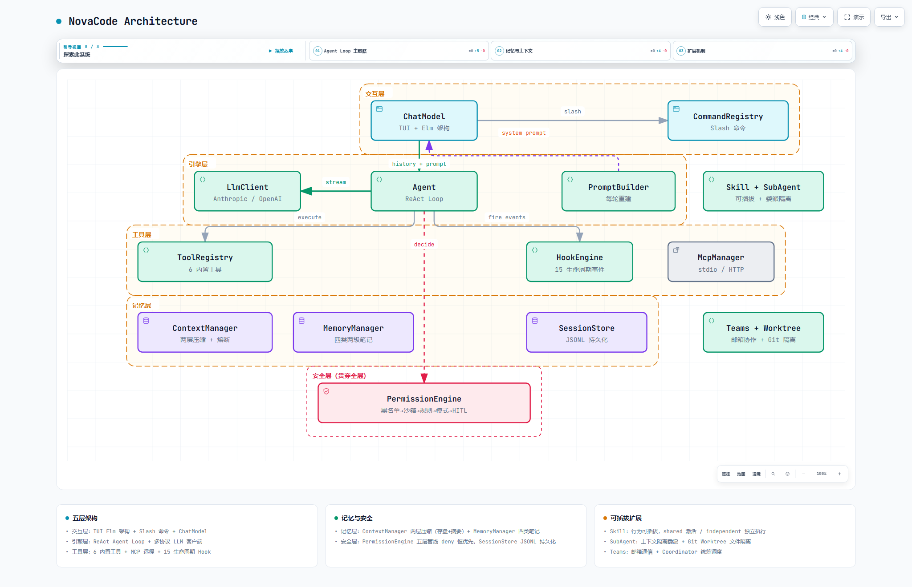

# NovaCode

> 一个从零实现的终端 AI 编程 Agent（Java 21）。多协议 LLM 客户端 · Function Calling 工具系统 · 五层权限 · 上下文压缩 · Prompt 缓存 · 跨会话记忆 · 多 Agent 协作。

NovaCode 是一个 **Coding Agent / Terminal AI Assistant**：你用自然语言下达指令，它在一个 Agent Loop 里自己调用 LLM、自己决定用哪个工具（读文件 / 写文件 / 跑命令 / 搜索）、看结果再决定下一步，直到任务完成。

区别于"聊天机器人"，NovaCode 具备真实的工具执行能力，并通过分层架构覆盖了 Coding Agent 的核心工程问题：**安全（五层权限）、成本（上下文两层压缩 + Prompt 缓存）、记忆（跨会话自动沉淀）、扩展（Slash / Skill / Hook / MCP）、协作（SubAgent + Git Worktree + Agent Teams）**。

项目规模：**128 个主源文件（约 1.2 万行）+ 26 个测试文件（205 个用例）/ 24 个包**，不依赖任何 Agent 框架。

---

## ✨ 特性

**核心引擎**

- **ReAct Agent Loop**：迭代上限 / 连续未知工具熔断 / 流超时 / 用户取消，四重停止条件保证任务必然收敛；取消时补齐工具调用配对，不产生孤儿 tool_call。
- **多协议 LLM 支持**：`LlmClient` 抽象 Anthropic 与 OpenAI-compatible（DeepSeek / GPT / 本地模型）两套流式协议，手写 SSE 解析（含 tool_call 增量参数累积、usage 双格式），配置切换、零代码改动；429/5xx 指数退避重试。
- **Prompt Caching**：字节级稳定前缀设计；Anthropic 显式 `cache_control` 断点（system + 末条消息增量断点）与 DeepSeek 自动前缀缓存双机制适配，状态栏实时显示缓存命中率（长会话实测 57%）。
- **上下文两层压缩**：预防层——超限工具结果落盘（8K/16K 阈值），对话只留预览 + 路径；兜底层——逼近窗口上限时 LLM 生成结构化摘要替换早期历史，边界强制对齐非 TOOL 消息（防孤儿 tool_call）；真实 usage 锚定 token 估算，摘要失败熔断保护。

**工具与安全**

- **Function Calling 工具系统**：7 个内置工具（ReadFile / WriteFile / EditFile / Bash / Glob / Grep / TodoWrite）+ MCP 远程工具统一注册；READ 并发批次 / WRITE+COMMAND 串行的分批执行（虚拟线程）。
- **五层权限拦截**：黑名单 → 路径沙箱 → 三级规则引擎 → 权限模式 → 人工确认（HITL），deny 恒优先、短路返回；子 Agent 无人在回路时确认自动降级为拒绝（安全默认）。
- **读后才能改**：FileStateCache 记录读取时的 mtime，文件被外部修改后拒绝基于过期视图的编辑。
- **编码自适应**：文件与进程输出按"严格 UTF-8 失败降级 GBK"探测解码，EditFile 写回保持原编码与 BOM——中文 Windows 环境不乱码。
- **输出防御**：模型输出渲染前剥离 ANSI 转义序列与控制字符，防终端注入。

**体验与协作**

- **TodoWrite 任务清单**：免确认、Plan Mode 可用、状态持久化、状态栏显示 ✓进度，长任务不跑偏。
- **会话管理**：JSONL 追加式存档（崩溃安全、孤儿调用截断），启动自动恢复，`/resume <id前缀>` 切换历史会话、`/session rm` 删除。
- **输入历史**：↑ 键回溯，持久化到 `~/.mewcode/prompt_history.jsonl`，跨会话可用。
- **Markdown TUI 渲染**：代码块 / 标题 / 列表 / 行内代码 / 链接的 ANSI 样式化输出（CommonMark AST → 平铺 span），流式阶段尾部跟随预览。
- **扩展机制**：Slash 命令、Skill（行为可插拔）、Hook（15 个生命周期事件）、MCP（工具可插拔）。
- **多 Agent 协作**：SubAgent 委派（上下文隔离）→ Git Worktree 文件隔离 → Agent Teams 协作（邮箱通信 + Coordinator 统筹调度）。
- **Elm 架构 TUI**：纯函数状态转移（Model / Message / UpdateResult），比命令式渲染更可控。

## 🏗 架构



交互式版本：[架构图](docs/novacode-architecture.html) · [执行流程图](docs/novacode-workflow.html)（浏览器打开）

```
┌─────────────────────────────────────────┐
│ 交互层   tui/tea · command · ui          │  TEA 终端界面、Slash 命令、ChatModel
│ 引擎层   agent · protocol · model        │  Agent Loop、LLM 客户端、事件流
│ 工具层   tool · mcp · hook               │  内置工具、MCP 接入、生命周期 Hook
│ 记忆层   context · memory · session      │  上下文压缩、自动记忆、会话持久化
│ 安全层   permission                      │  五层权限拦截（贯穿全层）
└─────────────────────────────────────────┘
```

- 5 层划分、每层独立可替换：加 MCP / Hook / Teams 时，Agent 核心循环一行未改。
- 关键约束：系统提示 = 字节级稳定前缀 + 易变后缀（缓存根基）；工具调用与结果必须成对（协议约束）；deny 在任意层短路（安全约束）。

## 📚 开发历程（15 章 · 13 个里程碑）

项目不是一次性写完的，而是从"纯对话闭环"出发、按章节逐层加厚，每一阶段都有独立的
**spec → plan → task → checklist** 闭环存档在 [`docs/milestones/`](docs/milestones/)：

| 里程碑 | 章节 | 主题 |
|--------|------|------|
| [01-foundation](docs/milestones/01-foundation/) | ch01–03 | 多协议 LLM 客户端 + 流式 TUI（纯对话闭环） |
| [02-agent-loop](docs/milestones/02-agent-loop/) | ch04 | ReAct Agent Loop |
| [03-prompt-engineering](docs/milestones/03-prompt-engineering/) | ch05 | 系统提示工程化（稳定前缀设计） |
| [04-permission](docs/milestones/04-permission/) | ch06 | 五层权限系统 |
| [05-mcp](docs/milestones/05-mcp/) | ch07 | MCP 客户端接入 |
| [06-context](docs/milestones/06-context/) | ch08 | 上下文管理（落盘 + 摘要双层压缩） |
| [07-memory-session](docs/milestones/07-memory-session/) | ch09 | 记忆与会话持久化 |
| [08-command](docs/milestones/08-command/) | ch10 | Slash 命令注册与分发 |
| [09-skill](docs/milestones/09-skill/) | ch11 | Skill 系统 |
| [10-hook](docs/milestones/10-hook/) | ch12 | Hook 生命周期引擎 |
| [11-subagent](docs/milestones/11-subagent/) | ch13 | 子 Agent 委派（上下文隔离） |
| [12-worktree](docs/milestones/12-worktree/) | ch14 | Git Worktree 文件隔离 |
| [13-agent-teams](docs/milestones/13-agent-teams/) | ch15 | Agent Teams（邮箱 + Coordinator） |

> ⚠️ `01-foundation` 是**阶段档案**，保留当时状态（其中的类名与"不做的事"清单不代表项目现状），
> 已在文档顶部标注范围声明。当前状态以本 README 为准。

## 🛠 技术栈

| 关注点 | 选型 |
|--------|------|
| 语言 | Java 21（虚拟线程并发批次、sealed interface、record、模式匹配 switch） |
| 终端控制 | JLine 3（raw mode + ANSI 内联渲染） |
| 流式 HTTP | JDK `java.net.http`（SSE 手写解析） |
| JSON / YAML | Jackson databind + dataformat-yaml |
| Markdown 渲染 | CommonMark-Java |
| 构建 | Maven（shade 打包可执行 jar） |
| 测试 / CI | JUnit 5（205 个用例，`mvn test`）+ GitHub Actions |

## 🚀 快速开始

```bash
# 1. 准备 JDK 21 + Maven
# 2. 配置 LLM provider（模板见 config.example.yaml）
cp config.example.yaml config.yaml
#    编辑 config.yaml 填入你的 api_key

# 3. 编译并打包
mvn -q package

# 4. 运行（Windows 中文环境建议用 launch.bat，已处理控制台编码）
java -jar target/novacode-1.0.0.jar
```

`config.yaml` 支持多 provider：缺省用第一个，`--provider <名称|序号>` 选择（名称忽略大小写、支持唯一前缀）：

```bash
java -jar target/novacode-1.0.0.jar                       # 第一个 provider
java -jar target/novacode-1.0.0.jar --provider GPT-4o     # 按名称
java -jar target/novacode-1.0.0.jar --provider 2          # 按序号
```

运行中用 `/model <名称|序号>` 热切换（client / 上下文窗口 / 摘要器 / 环境块联动重建），`/model` 列出全部。

## ⌨️ 常用命令

| 命令 | 作用 |
|------|------|
| `/help` | 列出全部命令（Tab 补全命令名） |
| `/status` | 会话、权限模式、Token 用量与缓存命中率 |
| `/model [名称\|序号]` | 列出 / 热切换 LLM provider |
| `/plan` · `/do` | 进入只读规划模式 / 切回执行并推进 |
| `/resume <id前缀>` · `/session` · `/session rm <id前缀>` | 会话切换 / 列表 / 删除 |
| `/compact` | 手动触发上下文压缩 |
| `/memory` · `/permission` | 查看记忆索引 / 权限规则 |
| `/new` · `/clear` · `/exit` | 新会话 / 清空消息区 / 退出 |

快捷键：Shift+Tab 循环权限模式 · ↑ 调输入历史 · PgUp/PgDn 滚动 · Esc 中断当前任务。

## ⚙️ 配置参考（config.yaml）

```yaml
providers:
  - name: "DeepSeek"            # 名称（--provider / /model 用）
    protocol: openai-compat     # anthropic | openai | openai-compat
    api_key: "sk-..."           # 支持 ${ENV_VAR} 展开
    model: deepseek-flash
    base_url: "https://api.deepseek.com"
    context_window: 128000      # 模型真实窗口（影响自动压缩触发时机）
    max_tokens: 8192            # 单次响应输出上限
    thinking: false

enable_coordinator_mode: false  # Agent Teams 的 Coordinator 开关（需配合环境变量）
```

MCP 服务器可配置在同一文件的 `mcp_servers` 段（用户级 `~/.novacode/config.yaml` 与项目级合并，项目覆盖同名）。

## 🧪 测试

```bash
mvn test    # 205 个用例
```

覆盖：**Agent Loop 端到端**（脚本化 FakeClient 驱动真实循环：自然停止 / 工具结果回流 / 权限拒绝 / 迭代上限 / 并发批次 / Hook 注入与拦截）、协议层消息构建与 SSE 解析、上下文压缩边界对齐、工具层（编码往返 / replace_all / 截断续读 / 输出模式）、五层权限语义、会话存档与恢复、SubAgent 编排、Markdown 渲染、Prompt 缓存前缀一致性。测试驱动修复了 ANSI 注入防御失效、超时边界竞态、孤儿进程树等 7+ 个深层缺陷。

## 📖 目录结构

```
src/test/java/com/novacode/    单元测试（26 个测试类，与主代码同包对应）
src/main/java/com/novacode/
├── agent/        Agent Loop、LoopPolicy、事件流、停止条件
├── command/      Slash 命令框架
├── config/       配置加载与校验
├── context/      上下文压缩（落盘 + 摘要 + 熔断 + token 锚定）
├── hook/         Hook 生命周期引擎
├── mcp/          MCP 客户端（stdio / HTTP）
├── memory/       自动记忆（四类两级）、AGENTS.md 指令加载
├── model/        模型 / 工具 / 会话领域模型
├── permission/   五层权限引擎
├── prompt/       System Prompt 构建（稳定前缀）、Plan Mode 提醒
├── protocol/     LLM 协议适配（Anthropic / OpenAI-compat，SSE + 重试 + 缓存断点）
├── session/      会话持久化（JSONL，恢复 / 删除 / 孤儿截断）
├── skill/        Skill 系统
├── subagent/     子 Agent 委派（隔离 / 工具过滤 / 超时续跑）
├── teams/        Agent Teams 协作（邮箱 / 任务板 / Coordinator / Worktree）
├── tool/         工具注册表 + 7 内置工具（含 TodoWrite）
├── tui/          Elm 架构终端运行时
├── ui/           渲染器、ChatModel、Markdown 视图
└── worktree/     Git Worktree 隔离
```
